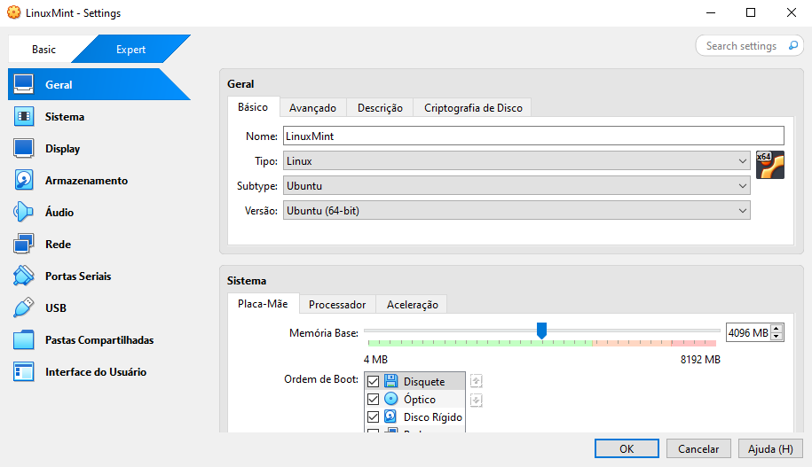
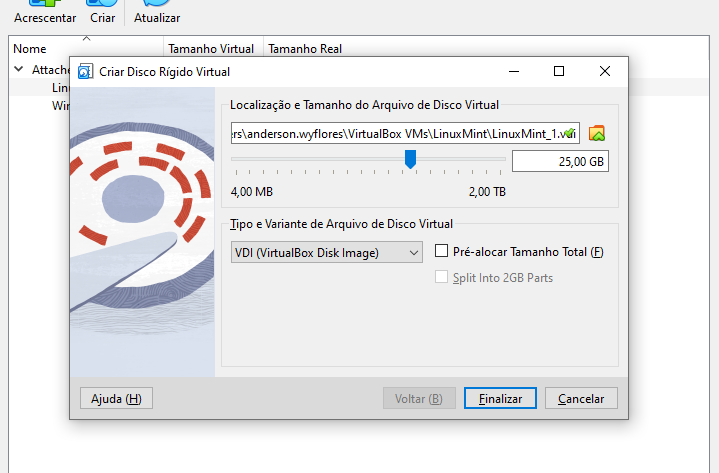
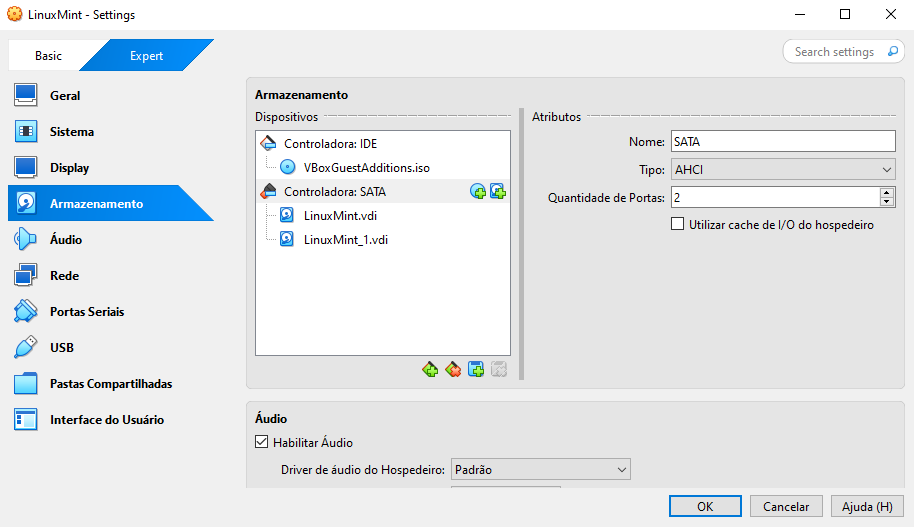
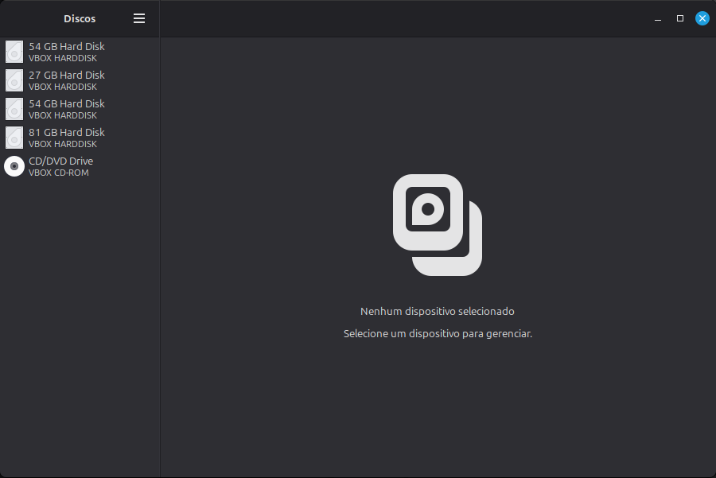
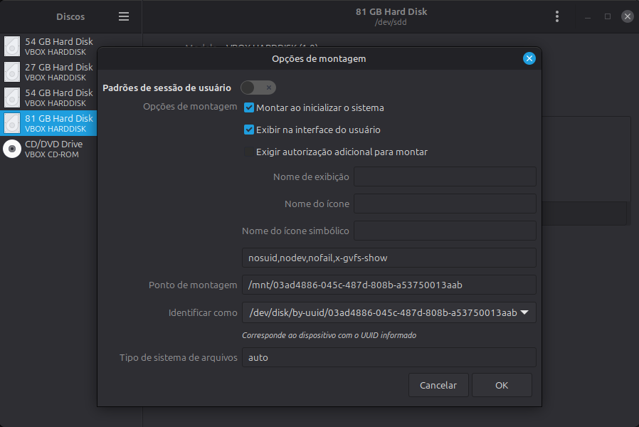
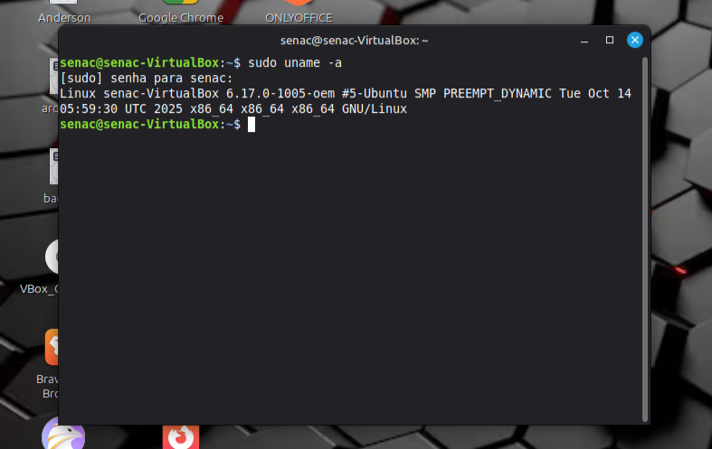
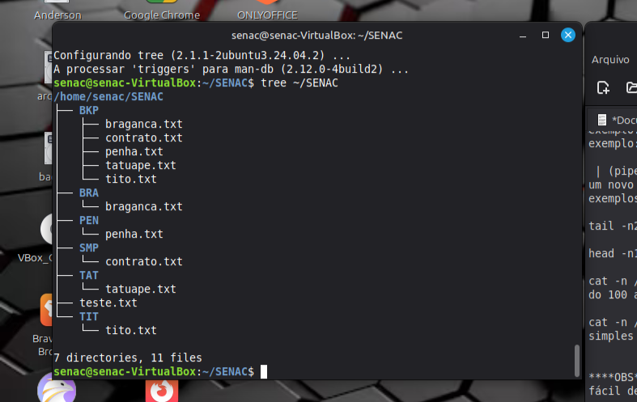

 -

# Linux Mint - Prática

**Unidade Curricular 4 - SENAC**

> **Data:** Novembro de 2025

**Professor:** Robson Vaamonde

---

## Descrição

Repositório com registros de práticas realizadas durante aulas de Linux, incluindo criação de máquina virtual, configuração de disco e uso de comandos no terminal.

---

## Objetivo

Registrar o aprendizado inicial em Linux, com foco em prática e familiarização com o ambiente de terminal e gerenciamento básico do sistema.

---

## Conteúdo

Durante as aulas foram realizadas atividades como:

- Criação de máquina virtual no VirtualBox
- Criação e configuração de disco (HD virtual)
- Gerenciamento de discos no sistema Linux
- Execução de comandos no terminal
- Instalação de programas e configuração básica

---

## 🖥️ Práticas realizadas

### Criação da máquina virtual

### Gerenciamento de discos

### Uso do sistema

---

## Observação

Este repositório representa atividades iniciais de estudo, com foco em aprendizado prático.
